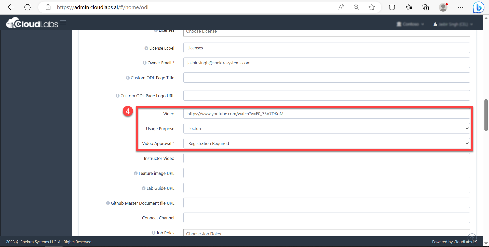
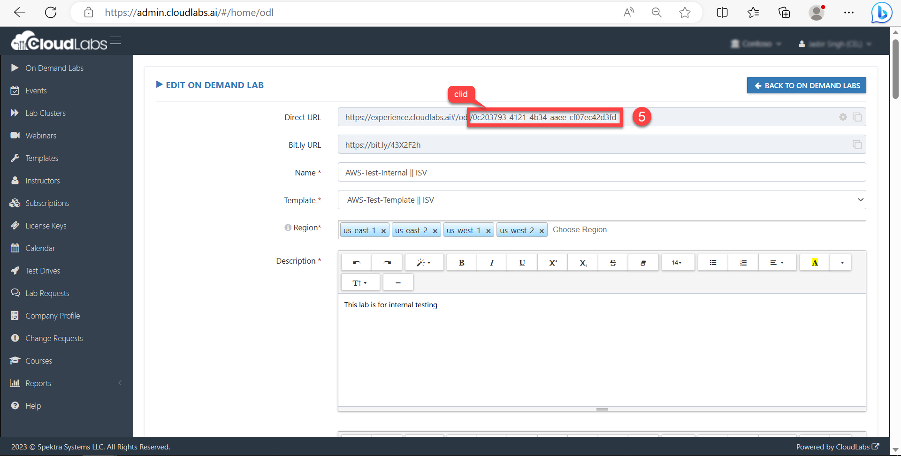
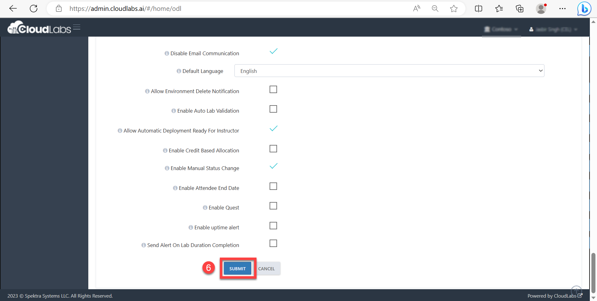
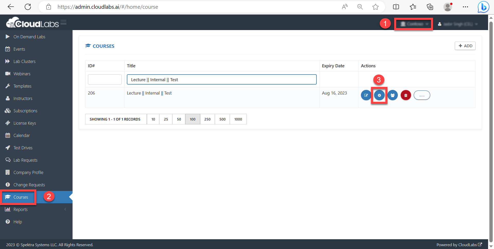
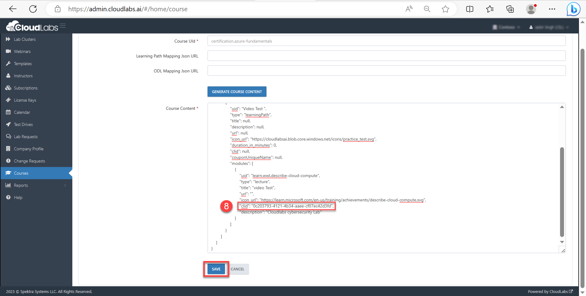
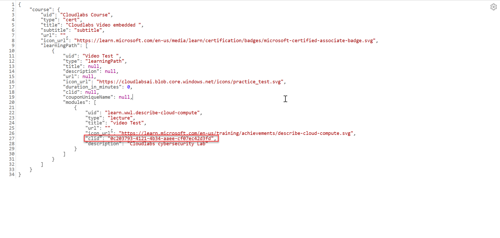
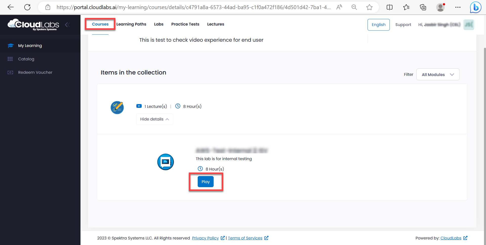

# **Adding Video Content File To Course**

###

### **Overview**

The objective of this document is to know how we can add video to the On Demand labs which will be accessed through CloudLabs Portal.

Follow the below steps to get started: -

Navigate to [https://admin.cloudlabs.ai/](https://admin.cloudlabs.ai/) and Login to the Admin Centre or follow this detailed guide [click here](https://docs.cloudlabs.ai/Instructor/GettingStarted)

1. Select your Tenant
2. Click on **On Demand**** Labs** from the left navigation pane.
3. Click on Edit under Actions.

1. Scroll down towards the following fields mentioned below to add video file to On Demand Lab and fill in the required details. The field marked with an asterisk sign (\*) is mandatory. Refer to the explanation below If you need help understanding the usage of each field.

- **Video:** Paste the video link in the tab. This option is used for adding a video link.
- **Usage**** Purpose:** This is an optional field. Users need to select Lecture or None.
- **Video Approval\*:** Select how you would like to approve the requests.

5. Scroll to the top and copy the **clid parameter** and save it in Notepad to use for upcoming steps.

6. Click on **Submit** to save the configured changes.

7. Navigate again to https://admin.cloudlabs.ai/ to map the On Demand Lab video to Cloudlabs Course.

1. Select your **Tenant**
2. Click on **Courses (2)** from the left navigation pane and select the course.
3. Click on **Settings (3)** button under Actions.

8. Modify the Course Content Section having **clid parameter** in JSON format which we need to replace with clid parameter**(0c203793-4121-4b34-aaee-cf07ec42d3fd)** which we saved in step 5.

**Sample JSON Syntax for Course Section Content.**

9. Course is now mapped with the video link which we provided in the On Demand Lab in Steps 4.

Course video file can be accessed through login [https://portal.cloudlabs.ai/](https://portal.cloudlabs.ai/).

10. Navigate to the Courses section from the top menu and click on **Play button** to play the video content.

