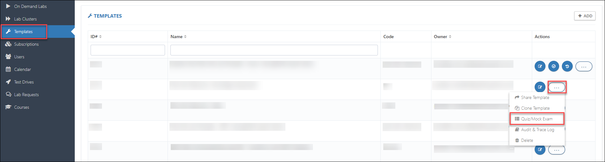

# How to create knowledge assessment

## Create the template for knowledge assessment

1. Navigate to **Templates** section that is available in the left menu and click on **+ ADD** button given in the top right corner.

    

2. Fill the necessary fields given below:

    * **Name:** To identify the lab, give a name to the Template.

    * **Cloud Platform:** CloudLabs supports three cloud platforms - Microsoft Azure, Amazon Web Services & Google Cloud Platform. Based on your lab requirements you can pick a cloud platform from the drop down.

    * **Code:** Use a code as an internal identifier.

    * **Description:** Provide a brief description to describe your lab, its resources and technologies as well as its learnings and benefits. It will be visible to the end users as well.

    * **Lab Launch Page Description:** Lab Launch page is basically where you launch your lab environment. You can add any additional instructions to this page that you think are relevant for the users.

        

    * **Owner Email:** In this field you have to provide Email address of the person who is responsible to build the Template.

    * **Region:** In this field you have to provide the Region of the deployment.

        

3. Click on **Submit**.

# Create a Quiz/Mock Exams

1. Once You have successfully completed the template creation as suggested in above steps follow the following steps to create **Quiz/Mock Exams**.

    * Navigate to **Templates** section and select the template that you have recently created and click on the **Elipses icon**.

        

    * Select the **Quiz/Mock Exam**.

        

    * Click on the **+ADD button** to add a new **Quiz/Mock Exam**.

        

    *  **Note: While adding Quiz, you would need to enter "Practice Test GUID" which will be shared by our engineering team due to backend configurations so once you have the "Product ID" please do share that with us and we will get you the GUID**

    * Fill out the following details:
    
        1.  **Name:**  In this field you have to provide Name for the **Quiz/Mock Exam**.

        2.  **Description:** In this field you have to provide a brief detail about the **Quiz/Mock Exam**.

        3.  **Quiz Type:** In this field you have to select the **Practice Test** from the drop down list.

            

        4. **Product Id:** In this field you have to fill the Product Id copied from GitHub repo ExamMetaData.md

            

        
        5. **Practice Test Guid:** In this field you have to fill the unique GUID which you can obtained from engineering team after sharing the GitHub URL.

        6. **Pass Percentage:** In this field you have to fill the pass percentage for the **Quiz/Mock Exam**.

        7. Click on **Submit**.

            

#   Create an On-Demand-Lab for Quiz/Exam

1. Navigate to **On Demand Labs** section that is available in the left menu and click on **+ ADD ON DEMAND LAB** button given in the top right corner and fill up the required information.

    

    * **ODL Name:** Enter a preferred name for your ODL. This will help you identify the labs in the listed ODLs.

    * **Template:** Select the appropriate template for the lab using the drop-down list.

    * **Region:** Select the nearest region for the deployment (Available regions will automatically fetch by Selecting a template.)

    * **Description:** Provide a brief description to describe about your **Quiz/Mock Exam**.

    * **Lab Launch Page Description:** Lab Launch page is basically where you launch **Quiz/Mock Exam** environment. You can add any additional instructions to this page that you think are relevant for the users.

        

    * **Tags:** Tags help you add keywords to your ODL, generally useful to identify the ODL and are displayed in the registration page as well.

    * **Status:** Select the appropriate Registration/Activation status for your ODL.

    * **Approval**: Select how would you like to approve the requests.

    * **Duration (in minutes):** Enter the duration in minutes for which you would like the **Quiz/Mock Exam** to be active. The duration starts as soon as the user signs up for the **Quiz/Mock Exam**.

    * **Expiry date:** Enter the last date when user can take **Quiz/Mock Exam**.

    * **Maximum number of Users:** Number of users who can access the **Quiz/Mock Exam**.

    * **Maximum retake count:** Maximum number of times an email ID can be used to register for **Quiz/Mock Exam**.(default is 0).

    * **Subscription Group:** Here you can select your subscription group which would be used to host the deployments in the for the **Quiz/Mock Exam**.

    * **Owner email:** Email ID entered here will be receiving all the communications and notifications for the ODL.

        

    * **Enable Run Practice Test On User Context and click on Submit**

        
