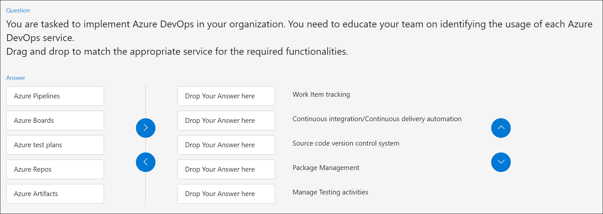
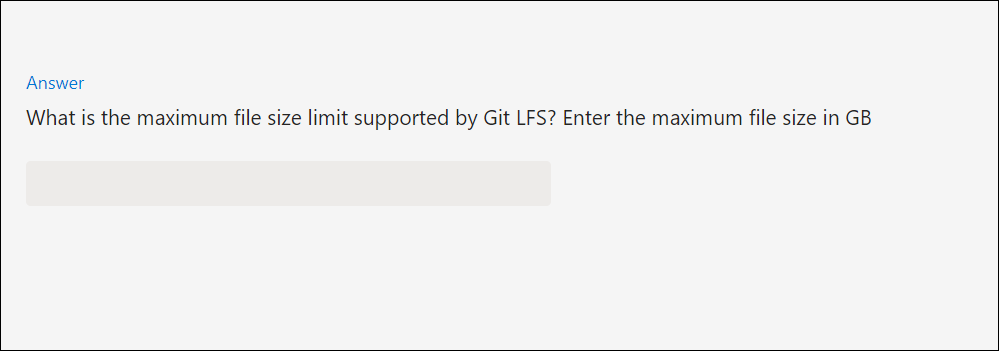

# How to Author Practice Test(Knowledge Assessment) in github?

1. Create a **Public GitHub Repository**.

2. Provide an access to the required members of the team.

3. Follow the below GitHub URL to prepare questions for the Assessment.
   
# Types of the Question in the knowledge Assessment

## Single Choice
 Only one answer can be selected from the given options.

 

We can create the single choice question by using below question format.

 Sample Question Format Link: https://github.com/CloudLabsAI-Azure/Assessment-Sample/blob/main/Practice-Test/Section-01/Question-01.md

 ## Multiple Choice
   It had more than one correct answer and the number of correct answers has to be specified under the Max answers tag.

  

We can create the Multiple choice question by using below question format.

 Sample Question Format Link: https://github.com/CloudLabsAI-Azure/Assessment-Sample/blob/main/Practice-Test/Section-01/Question-02.md

## Match Options
  We have Labels and options which we need to match, If the question text is long or a sentence, we can add it in the options instead of the labels.

  

   We can create the Match Options question by using below question format.

 Sample Question Format Link: https://github.com/CloudLabsAI-Azure/Assessment-Sample/blob/main/Practice-Test/Section-01/Question-03.md

 ## Built List
  We need to arrange the options in a sequential manner

  

  
  We can create the Built List question by using below question format.

 Sample Question Format Link: https://github.com/CloudLabsAI-Azure/Assessment-Sample/blob/main/Practice-Test/Section-01/Question-04.md

 ## Dropdown
  We can use dropdown question type when we have multiple options and multiple questions in the single question. Any number of dropdowns can be used.

  

   We can create the Dropdown question by using below question format.

  Sample Question Format Link: https://github.com/CloudLabsAI-Azure/Assessment-Sample/blob/main/Practice-Test/Section-01/Question-05.md

## Build Tree
 Can be used when we have multiple/one/or no correct answers for a question. Similar to match options.

We can create the Build Tree question by using below question format.

Sample Question Format Link: https://github.com/CloudLabsAI-Azure/Assessment-Sample/blob/main/Practice-Test/Section-01/Question-06.md

## Multiple Single Choice

Created a radio box with two options. Can be used when we have multiple questions which require binary answers like Yes or no or True or False

We can create the Multiple Single Choice question by using below question format.

Sample Question Format Link: https://github.com/CloudLabsAI-Azure/Assessment-Sample/blob/main/Practice-Test/Section-01/Question-07.md

##  Numeric Input

We can enter the numeric answer for the question.

We can create the Numeric Input question by using below question format.

Sample Question Format Link: https://github.com/CloudLabsAI-Azure/Assessment-Sample/blob/main/Practice-Test/Section-01/Question-08.md

