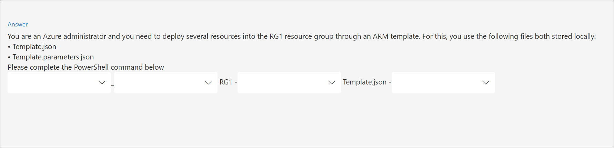

# How to Author Practice Test(Knowledge Assessment) in GitHub?

1. Create a **Public GitHub Repository**.

2. Provide an access to the required members of the team.

3. Follow the below steps to create Questions for the Assessment.

**Note:**
   * **We need to create one separate Folder for each new Practice Test that we need to onboard.**
   * **We need to create one separate Markdown file for each Questions and the naming conventions for the Questions markdown file should be "Question-(xx).md(Here (xx) is a numeric value for eg Question-01.md)."**  
   * **Once you have authored the practice test in the github, connect with the CloudLabs team to onboard it on the CloudLabs portal.**
   
# Types of the Questions and their format for the Practice Test(Knowledge Assessment).

**There are eight types of Questions which are supported**

   * Single Choice
   * Multiple Choice
   * Match Options
   * Built List
   * Dropdown
   * Build Tree
   * Multiple Single Choice
   * Numeric Input

## Single Choice
 Only one answer can be selected from the given options.

 

We can create the single choice question by using below question format.

 **Sample Question Format Link: https://github.com/CloudLabsAI-Azure/Assessment-Sample/blob/main/Practice-Test/Section-01/Question-01.md**

 ## Multiple Choice
  It may have more than one right answer, and the quantity of right answers must be indicated under the Max answers tag.

  

We can create the Multiple choice question by using below question format.

 **Sample Question Format Link: https://github.com/CloudLabsAI-Azure/Assessment-Sample/blob/main/Practice-Test/Section-01/Question-02.md**

## Match Options
   We have Labels and options which we need to match, If the question text is long or a sentence, we can add it in the options instead of the labels.

  

   We can create the Match Options question by using below question format.

 **Sample Question Format Link: https://github.com/CloudLabsAI-Azure/Assessment-Sample/blob/main/Practice-Test/Section-01/Question-03.md**

 ## Built List
  We need to arrange the options in a sequential manner

  

  
  We can create the Built List question by using below question format.

 **Sample Question Format Link: https://github.com/CloudLabsAI-Azure/Assessment-Sample/blob/main/Practice-Test/Section-01/Question-04.md**

 ## Dropdown
  We can use dropdown question type when we have multiple options and multiple questions in the single question. Any number of dropdowns can be used.

  

   We can create the Dropdown question by using below question format.

  Sample Question Format Link: https://github.com/CloudLabsAI-Azure/Assessment-Sample/blob/main/Practice-Test/Section-01/Question-05.md

## Build Tree
 Can be used when we have multiple/one/or no correct answers for a question. Similar to match options.

We can create the Build Tree question by using below question format.

**Sample Question Format Link: https://github.com/CloudLabsAI-Azure/Assessment-Sample/blob/main/Practice-Test/Section-01/Question-06.md**

## Multiple Single Choice

Creates a radio box with two options can be utilized when we have several questions that call for binary responses, such as True or False or Yes or No.

We can create the Multiple Single Choice question by using below question format.

**Sample Question Format Link: https://github.com/CloudLabsAI-Azure/Assessment-Sample/blob/main/Practice-Test/Section-01/Question-07.md**

##  Numeric Input

We can enter the numeric answer for the question.

We can create the Numeric Input question by using below question format.

**Sample Question Format Link: https://github.com/CloudLabsAI-Azure/Assessment-Sample/blob/main/Practice-Test/Section-01/Question-08.md**

